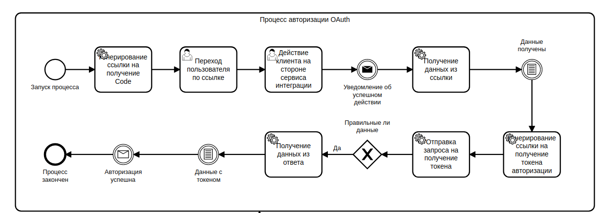

# clickup_api
#### Инструкция по интеграции с ClickUp Service с применением API V2

##### Процессы 
- OAuth авторизация
- ClickUp API V2 (Пользователи, команды, задачи.)

##### Python зависимости
- httpx
- pydantic

<br>

##### Основной ресурс для работы  https://clickup.com/api
## Добавления приложения в ClickUp
- Создайте приложения в ClickUp <br>
**WorkSpace >> Settings >> Integrations >> ClickUp API >> + Create an App** <br>
 
Важно **redirect_uri** должны быть домены https если разрабатываете локально используйте **ngrok**
Карточка приложения после создания:
```
App Name My App
CLIENT ID 1PZ9zOi5sZNE6-93gHE5ZAQpX*******
CLIENT SECRET RSwPUs8i2vsrxodnI-xEycxFbN-******
REDIRECT URLS https://41095d8af8a2.ngrok.io/webhook/login
```
Если используете ngrok вам придется менять карточку приложения каждый раз когда истекает действие работы ngrok (каждые 2 часа)

- Скопируйте и вставьте значения CLIENT_ID и CLIENT_SECRET в ваше приложение.

## OAuth авторизация
#### OAuth авторизация происходит следующим образом:

### Воспроизведение процесса кодом
- Генерирование ссылки на получение Code
```
from clickup.service import ClickUpOAuth

# State - Данные которые вернутся на вебхук
# используется для идентификации пользователя
state = dict(user_id=1)

# Наш webhook который установили в ClickUpApp
redirect_uri = https://41095d8af8a2.ngrok.io/webhook/login

url = ClickUpOAuth.get_code_url(redirect_uri, state)
print(url)

>>> 'https://app.clickup.com/api?client_id=1PZ9zOi5sZNE6-93gHE5ZAQpX*******&state=eyJ4IjogMX0=&redirect_uri=https://41095d8af8a2.ngrok.io/webhook/login'
```
Эту ссылку необходимо отдать пользователю для перехода по ней. <br>
Для допольнительной информации по get параметрам https://clickup.com/api >> Authentication <br>

- Прием уведомления об успешном входе (WebHook)
```
from oauth.webhooks import login_success

def login_success_to_system(request):
   code, state = login_success(request)
   print(code, state)

>>> login_success_to_system(request)
>>> 6655746, dict(user_id=1)
```

- Получение авторизационных данных (access_token)
```
from clickup.service import ClickUpOAuth

token_data = await ClickUpOAuth().get_token(code, redirect_uri)

print(token_data)
>>> dict(token=dict(access_token=***))
```
После успешного получения токена авторизации можно использовать ClickUp API


### Использование ClickUp API V2
После получения токена авторизации его необходимо передавать в Headers каждого запроса.
```
from clickup.service import ClickUp

clickup = ClickUp(f"{token_data['token']['access_token']}")

click_up_user = await clickup.get_user()
print(click_up_user)
>>> dict(user=dict(id=123, name=AlexDemure, email=your_email@gmail.com)
```
